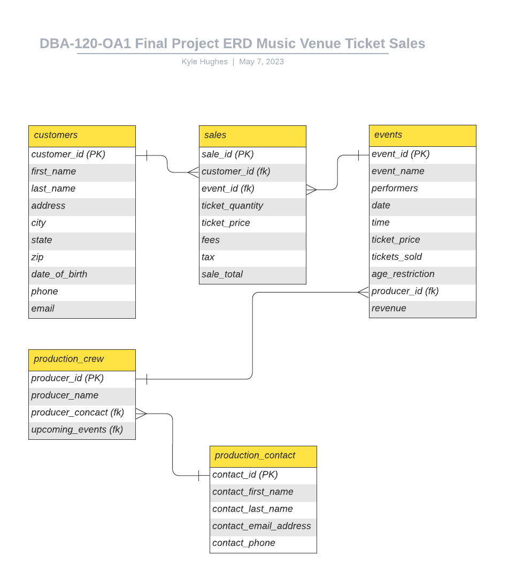
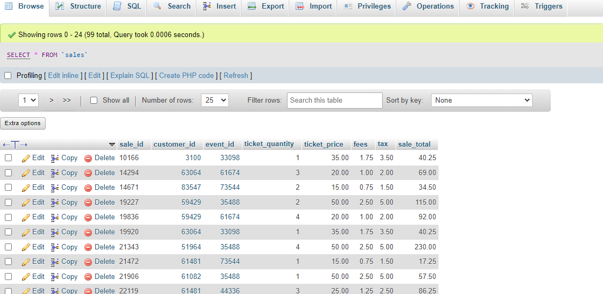
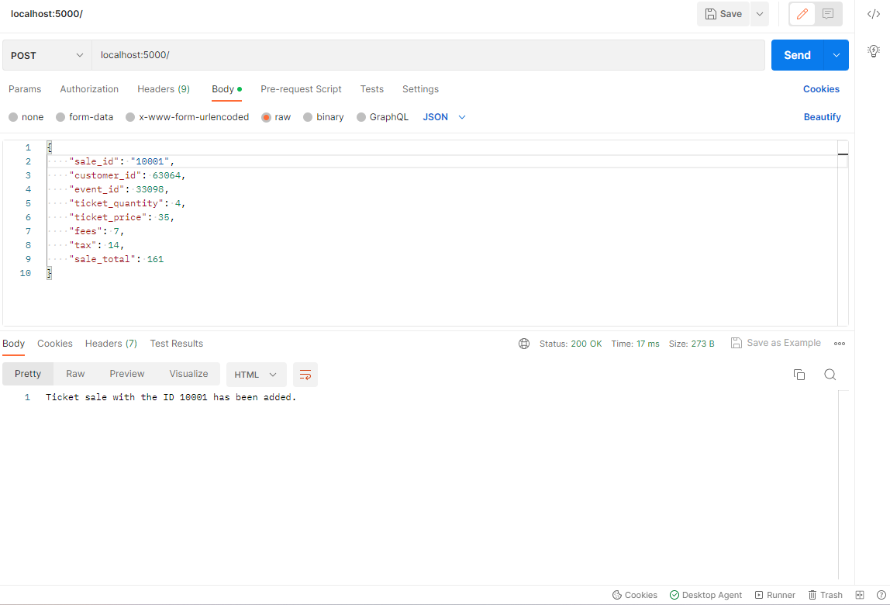
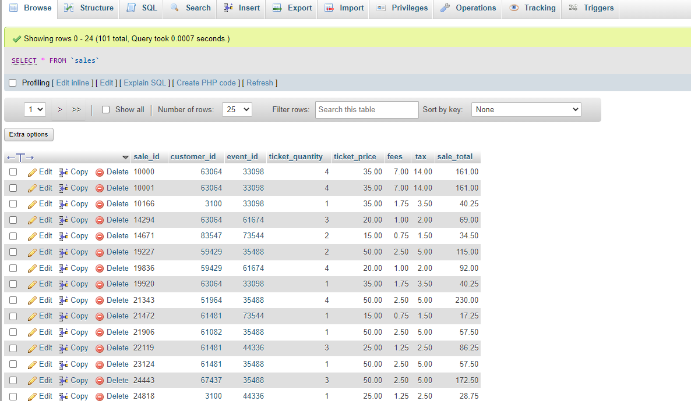
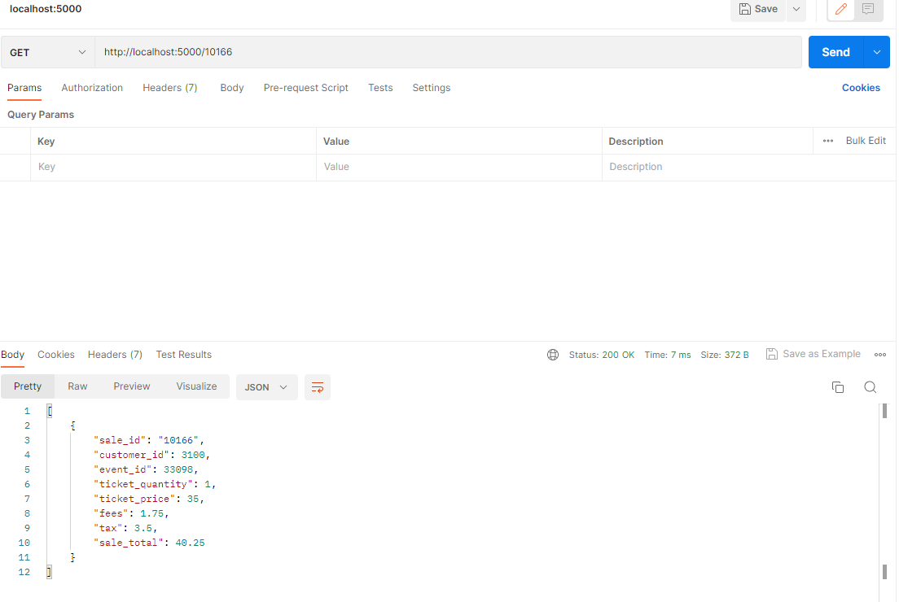
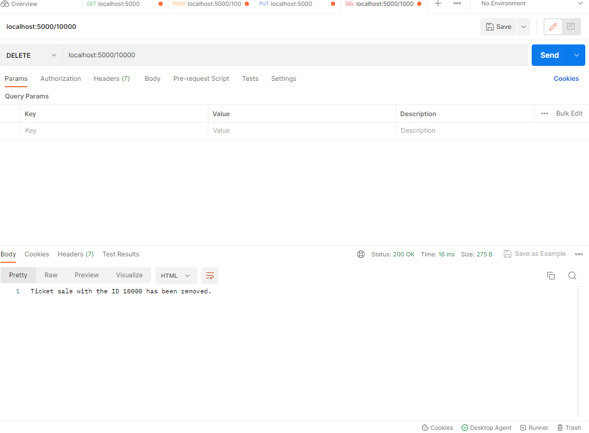
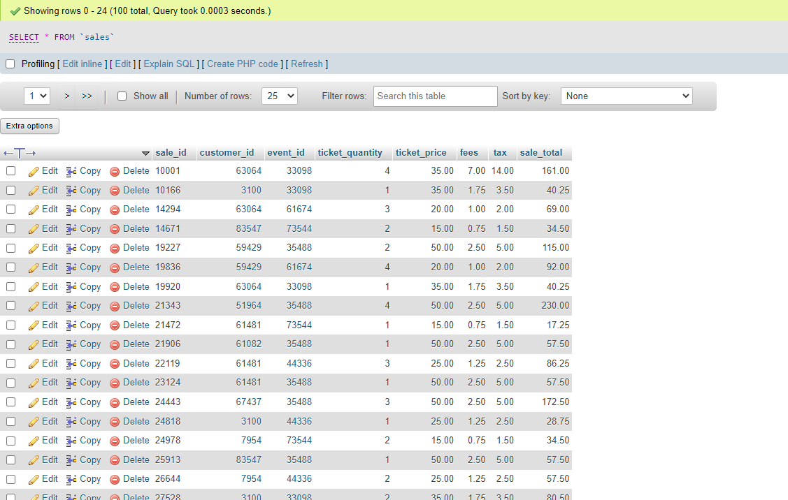
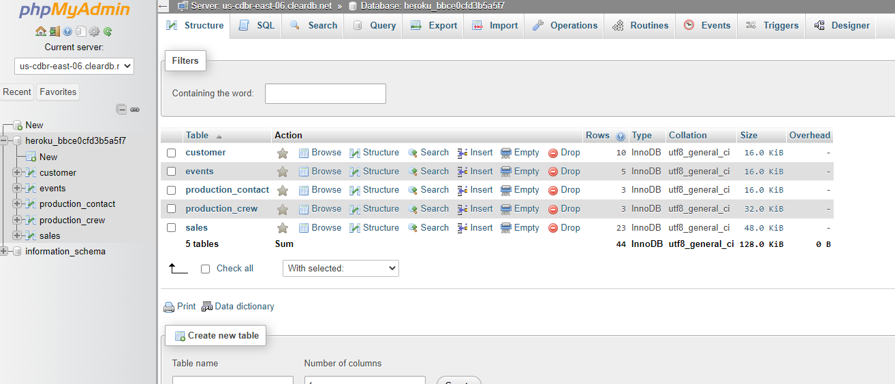
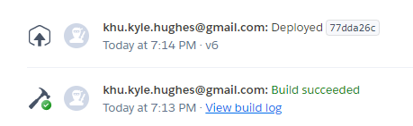

# DBA-120-OA1 Final Project - Music Venue Ticket Sale Database
## Kyle Hughes

### Intro
I created a database to help a local music venue track its ticket sales and revenue.

### Project Part 1
Here is the ERD ([LucidChart](https://lucid.app/lucidchart/f3d98e80-2da0-4457-a795-b06fbfb41133/edit?viewport_loc=-214%2C56%2C2225%2C1058%2C0_0&invitationId=inv_31665265-59b2-44d0-8c11-c70ae3808f8f)) 

Here is the SQL code used to setup the database: 
**Setup:** ([setup.sql](setup.sql))

Here is the SQL code used to populate the database with records: 
**Insert:** ([insert.sql](insert.sql))

### Project Part 2
Using Node.JS I was able to connect to the database and perform CRUD operations. 
Here is the code for the app.js file we created for our operations: ([app.js](app.js)) 

Using Postman I ran the operations.

#### CREATE:
We can add records. 
**Before:** 
 
 
**Operation:** 
 
**After:** 
 

#### READ:
We can display specified records. 
**Operation:** 
 

#### DESTROY:
We can remove records. 
**Before:** 
 
**Operation:** 
 
**After:** 
 

### Project Part 3
We deployed our Database to the Cloud using Heroku. 

It can be reached here: ([Heroku App](https://ticket-sales-db.herokuapp.com/))
